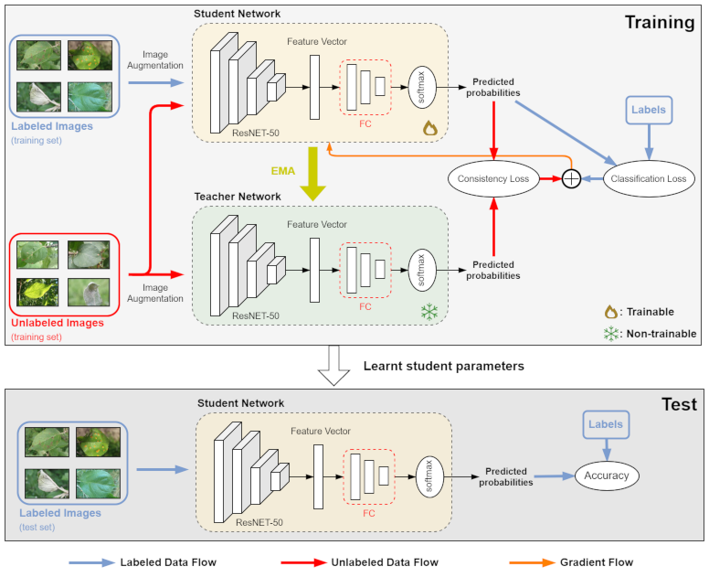

# Consistency Regularization Based Semi-supervised Plant Disease Recognition

Source codes for our [paper](https://www.sciencedirect.com/science/article/pii/S2772375524002181?via%3Dihub).

- Training set split of [Plant Pathology 2021](https://www.kaggle.com/c/plant-pathology-2021-fgvc8) dataset (PP2021TS). Balanced and unbalanced splits.
<p align="center">

</p>

- [Mean-teacher](https://arxiv.org/abs/1703.01780) model applied for semi-supervised plant disease recognition.
<p align="center">

</p>

- Supports HeadOnly and HeadThenBody training strategies.
<p align="center">

</p>

- Supports several deep architectures for supervised training.
- Supports HeadOnly and HeadThenBody training for three semi-supervised learning methods: Mean-teacher, [MixMatch](https://arxiv.org/abs/1905.02249) and [Virtual Adversarial Training](https://arxiv.org/abs/1704.03976).

## Run
We conducted experiments under
- Python 3.12 
- PyTorch 2.2.1, torchvision 0.17.1, torch-summary 1.4.5
- Numpy 1.26.4

Unzip [data.zip](https://drive.google.com/file/d/1A2a5OOTdSApDOPJGdXfMpaYEyOWrvKMx/view?usp=sharing) which will create ./data folder containing balanced and unbalanced datasets.

Check cli.py for the available parameters of the train.py script.
Pre-trained PyTorch models accepted by the script via the `--arch` parameter are `resnet50`, `inception_v3`, `densenet121`, `densenet201`, `convnext_tiny` and `mobilenet_v3_large`.

Each training session creates its own experiment folder under the ./result folder.

### Supervised training
- The following call trains on the balanced dataset, using HeadOnly strategy, ResNET-50 model as the model body, Fully Connected Network (FCN) as the classifier head, batch size 32, all labels and early stopping with default patience value. Unspecified training parameters takes their default values specified in cli.py: number of epochs, SGD parameters (learning rate, momentum, weight decay) and training augmentations (train-transforms).
```
$ python train.py ./data/balanced_sz_512_split --ftune-head fcn --ftune-strategy headonly --arch resnet50 --labeled-batch-size 32 --all-labels --early-stopping
```
- The following call trains on the unbalanced dataset, using HeadThenBody strategy, ResNET-50 model, FCN classifier head, batch size 32, 10% of the labeled data and strong training augmentations.
```
$ python train.py ./data/unbalanced_sz_512_split --ftune-head fcn --ftune-strategy headthenbody --arch resnet50 --labeled-batch-size 32 --num-labels 0.1 --exclude-unlabeled --train-transforms strong
```
- The following call trains on the unbalanced dataset, using HeadThenBody strategy, DenseNET-201 model, FCN classifier head, batch size 32, 25% of the labeled data and print frequency of 20 iterations. This training session loads a previously obtained HeadOnly training result and starts directly from the body fine-tuning stage.
```
$ python train.py ./data/unbalanced_sz_512_split --ftune-head fcn --ftune-strategy headthenbody --arch densenet201 --labeled-batch-size 32 --num-labels 0.25 --exclude-unlabeled -pf 20 --head-checkpoint ./result/007-densenet201_finetune_fcn_headthenbody_25p_sv_1000/network-head-best.pth
```

### Semi-supervised training
- The following call starts a training session that has access to only 5% of the labels but leverages unlabeled samples via the Mean-teacher method for better generalization. At each iteration 10 labeled (--labeled-batch-size) and 30 unlabeled (aux-batch-size - labeled-batch-size) samples are fetched. 
```
$ python train.py ./data/unbalanced_sz_512_split --ftune-head fcn --ftune-strategy headthenbody --arch resnet50 --labeled-batch-size 10 --num-labels 0.05 --ss-method mean-teacher --aux-batch-size 40 --ema-decay 0.99 --consistency 30 --consistency-rampup 5 -pf 20
```

- The following session trains using 5% of the labels and MixMatch method for semi-supervised learning. `--num-iters` defines number of iterations per epoch which is required for MixMatch and VAT training.
```
$ python train.py ./data/unbalanced_sz_512_split --ftune-head fcn --ftune-strategy headthenbody --arch resnet50 --ss-method mixmatch --num-labels 0.05 --labeled-batch-size 24 --aux-batch-size 48 --num-iters 400 -pf 40
```

## Contact for Issues
- Murat İlsever, murat.ilsever@std.yeditepe.edu.tr

## References
- Mean-teacher: [paper](https://arxiv.org/abs/1703.01780), [code](https://github.com/CuriousAI/mean-teacher/tree/master)
- Temporal Ensembling: [paper](https://arxiv.org/abs/1610.02242), [code](https://github.com/s-laine/tempens)
- MixMatch: [paper](https://arxiv.org/abs/1905.02249), [code](https://github.com/Jeffkang-94/Mixmatch-pytorch-SSL/tree/master)
- VAT: [paper](https://arxiv.org/abs/1704.03976), [code](https://github.com/9310gaurav/virtual-adversarial-training)